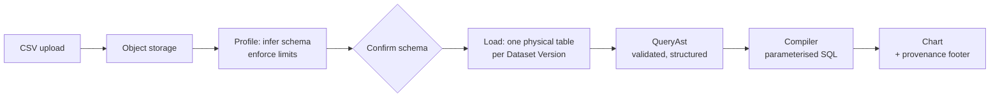

<div align="center">

# Datalize

### Turn a CSV into an answer you can trust.

Analytics for teams who need the number to be right, not just fast.

[Quick start](#quick-start) · [How it works](#how-it-works) · [Why it exists](#why-it-exists) · [Status](#status)

</div>

---

## Why it exists

An ops analyst at a thirty-person company exports a CSV from Stripe every month and wants to know
what happened to revenue. Today they have three bad options.

**A spreadsheet** stops being honest somewhere around a hundred thousand rows, and nobody can tell you
which export produced the chart in last quarter's board deck.

**A BI platform** wants a data team, a modelling layer, and a quarter of onboarding before it draws
the first bar.

**A warehouse** is the right answer eventually and the wrong answer now.

Datalize is the middle. Upload the file, see what the system inferred, ask the question, get a chart —
and be able to prove afterwards where the number came from.

## What makes it different

Most analytics tools optimise for producing a number. Datalize optimises for producing a number you
can defend. Three consequences of that, which you will notice within the first hour:

**Every chart knows its provenance.** A result records which Dataset Version it read and which
timezone it grouped by. "MRR by month" is not a number — it is a number _from this file, in this
timezone_. When last month's chart disagrees with this month's, you can see why instead of guessing.

**It refuses to answer badly.** Summing a column that mixes USD, GBP and EUR does not produce revenue;
it produces a meaningless number with a currency symbol on it. Datalize refuses that aggregate rather
than rendering it. The same applies to a schema that changed underneath a saved query: you get a
message naming the column that disappeared, never a blank chart or a silently dropped filter.

**Timezones are handled properly, out loud.** A transaction at `2026-12-01T00:30:00Z` belongs to
December in UTC and November in New York. Datalize picks one rule, applies it everywhere, prints it in
the chart footer, and tells you at import time how it read the timestamps in your file — including the
ones that fall inside a daylight-saving gap, which most tools silently mangle.

## What it does

- **Import a CSV** — up to 50 MB, a million rows, streamed rather than buffered, with a preview of the
  inferred schema and a chance to correct it before anything is committed
- **Keep versions** — re-upload next month's export as a new version of the same dataset; charts follow
  the latest data, and every execution records which version it actually read
- **Ask without SQL** — a visual builder over dimensions, measures, filters and time granularity
- **See it** — tables and bar charts to start, with the states that matter handled properly: loading,
  empty, error, truncated
- **Ask in words** — a read-only assistant that proposes a query and explains the result. It never
  executes anything itself and never changes a dashboard without you saying so

## How it works



Four ideas hold the design together:

**The Organization is the tenant boundary.** Tenant scope is never a function argument — it comes from
a server-created request context that re-verifies membership on every request. A function that accepts
an `organizationId` from its caller is a bug, not a shortcut.

**Each Dataset Version is its own physical table.** Real Postgres columns with real types, not a JSONB
blob. Table and column names are server-generated and never leave the storage module; queries name
columns by opaque ID.

**Queries are structured, never raw SQL.** A validated `QueryAst` compiles to parameterised SQL whose
identifiers come only from the server's own mapping. There is no string concatenation anywhere near a
user's input, and no arbitrary-SQL escape hatch to secure later.

**The analytical store is a boundary, not a database.** Postgres is the right engine at this scale.
When it stops being, the interface is already there.

## Status

**In active development. Not yet usable.** Built in vertical slices, each one a workflow a user can
complete end to end rather than a layer:

| Slice |                                                                |                 |
| ----- | -------------------------------------------------------------- | --------------- |
| 0     | Foundation — auth, workspaces, tenant isolation, CI            | In progress     |
| 1     | CSV to chart — import, versioning, query engine, table and bar | In progress     |
| 2     | Dashboards — widgets, layout, revision-checked saves           | Planned         |
| 3     | Pilot readiness — rate limits, retention, backups, audit       | Planned         |
| 4     | AI assistance — read-only, provenance, budgets                 | Planned         |
| 5     | Expansion — connectors, exports, billing                       | Evidence-driven |

Slice 5 is deliberately last and deliberately conditional. Nothing gets built there until a real user
demonstrates they need it.

## Quick start

Requires Node 22+, pnpm 10, and Docker.

```bash
pnpm install
docker compose up -d          # Postgres: dev on 5433, throwaway test DB on 5434
cp .env.example .env.local    # then set BETTER_AUTH_SECRET to 32+ random characters
pnpm db:migrate
pnpm dev                      # http://localhost:3000
```

`.env.test` is committed and already points at the test database, so the integration suite runs with
no further setup.

| Command                                                 |                                                        |
| ------------------------------------------------------- | ------------------------------------------------------ |
| `pnpm dev` · `pnpm build`                               | Develop and build                                      |
| `pnpm lint` · `pnpm format`                             | oxlint and oxfmt — the only linter and formatter       |
| `pnpm typecheck`                                        | `tsc --noEmit`, full strict flag set, no casts allowed |
| `pnpm test` · `pnpm test:integration` · `pnpm test:e2e` | Unit, integration, browser                             |
| `pnpm db:generate` · `pnpm db:migrate`                  | Schema and migrations                                  |

## Built with

Next.js · TypeScript · PostgreSQL · Drizzle · Better Auth · Trigger.dev · Zod · Tailwind · ECharts ·
Vitest · Playwright · oxc

Deliberately absent: ESLint, Prettier, Redis, an ORM escape hatch, and any service added because an
architecture diagram looked empty without it.

## Test fixtures

Three canonical CSVs stand in for what the target user actually uploads — a Stripe transaction export,
a customer list, a product event stream. The small versions are committed because they _are_ the
specification of the import rules: leading-zero identifiers that must not become integers, an `"N/A"`
in a decimal column, and naive timestamps sitting inside both a daylight-saving gap and a
daylight-saving overlap.

The 50 MB variants regenerate from a seeded script. See [`tests/fixtures/README.md`](tests/fixtures/README.md).

## Documentation

|                                    |                                                          |
| ---------------------------------- | -------------------------------------------------------- |
| [`CLAUDE.md`](CLAUDE.md)           | The brief — invariants, TypeScript and readability rules |
| [`CONTEXT.md`](CONTEXT.md)         | The glossary. Terms mean exactly what this says          |
| [`docs/README.md`](docs/README.md) | Index, and where each architectural decision landed      |
| `docs/decisions/`                  | Binding decisions                                        |
| `docs/adr/`                        | The decisions that are expensive to reverse              |
| `docs/reference/`                  | Source material, superseded wherever the above disagree  |

Every folder under `src/` carries its own `CLAUDE.md` with the rules for the code beside it. Those are
the authority; a README is not.
